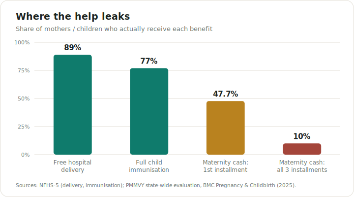
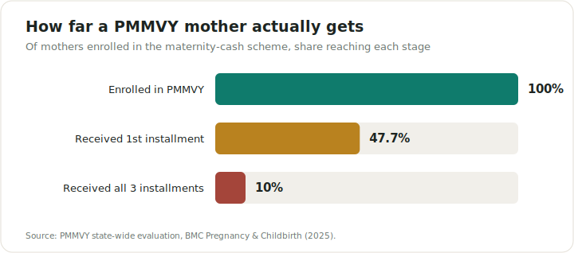
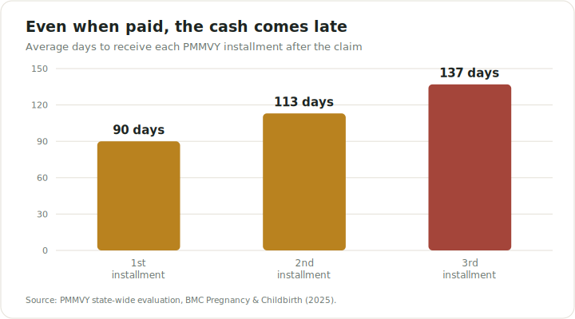

# Sahej · सहज

**Making sure no new mother in India misses the government help she's entitled to.**

## What is this? (in plain words)

When a baby is born in India, the government offers the mother real support — cash
payments, free hospital care, free vaccines for the baby, and more. Hospital delivery and
child vaccination now reach most families. But the **cash** benefits — the part that most
directly helps a poor household — largely don't arrive in full or on time: a state-wide
study found only about **1 in 10** mothers enrolled in the main maternity-cash scheme
received *all* of what they were owed ([see the charts below](#the-problem-in-three-charts)).
Not because the money isn't there, but because:

- nobody tells them which schemes they actually qualify for,
- the forms and rules are confusing and scattered across departments, and
- each benefit has a deadline that quietly passes.

So thousands of crores meant for poor families go unused every year, and mothers go
without help they had every right to.

**Sahej fixes the navigation.** It's a simple tool for the local government health
worker — the *ASHA* — who already visits every new mother at home. The worker enters a
few basic details about the mother and baby, and Sahej instantly shows:

- **every benefit she's owed**,
- **how much money** each one is,
- **which documents** she needs, and
- **the date by which to claim each one** —

laid out as a step-by-step checklist she can tick off over her routine visits, so nothing
slips through the cracks.

> **In one line:** Sahej turns a birth into a clear, dated checklist of every benefit the
> mother is owed — so the help actually reaches her.

### A quick example

Enter *a first-time mother in Bihar who delivered at a government hospital*. Sahej replies:
she's owed about **₹6,400** — claim the **₹1,400** delivery cash now, **register the birth
by day 21** (that unlocks another **₹2,000**), get the baby's first vaccines, and so on.
Change her state or situation and the answer updates automatically.

## Why this approach works (the core insight)

For childbirth, a trusted person is **already** at the mother's door on a fixed schedule:
ASHA workers make home visits on **days 3, 7, 14, 21, 28 and 42** after birth (and are paid
a small amount for each newborn they follow). Those visit days line up almost exactly with
the benefit deadlines. So Sahej doesn't need to invent a new app habit or a new field
force — it simply hands a smart checklist to someone who's already there, turning each
visit into *"here's exactly what this mother is owed today."*

## The problem, in three charts

*Figures are from the [sources listed below](#evidence--sources); the charts are generated
from that data by [`tools/make_charts.py`](tools/make_charts.py).*

**Hospital access is largely solved — the cash is where families fall off.** Most mothers
now deliver in a facility and most children are immunised; far fewer receive the full
maternity **cash** they're entitled to.



**The maternity-cash drop-off.** Of mothers enrolled in PMMVY, under half received the
first installment and only about 1 in 10 received all three.



**And when the cash does come, it arrives months late** — long after a newborn's costs have hit.



> The money is allocated — roughly **₹1 lakh crore** of welfare funds goes unspent every
> year. The gap is awareness, timing and follow-through. **That's the gap Sahej closes.**

## What's in this build

| File | What it is |
|------|------------|
| `PRODUCT_PLAN.md` | The owner's plan: personas, the full scenario matrix, feature set, roadmap. |
| `data/childbirth_schemes.json` | **The asset.** Structured, sourced rules + all **36 states/UTs** (LPS·HPS, opt-outs). |
| `data/death_schemes.json` | **Second life event** on the same engine: death registration, NFBS, widow pension, PMJJBY/PMSBY insurance claims, EPF/EPS/EDLI, BOCW death benefit, heir certificate. |
| `engine.py` | Pure-stdlib resolver: eligibility, blocking, claimed-tracking, urgency, documents, sensitive-mode, migrants, **input validation**. CLI + `meta()`. |
| `store.py` | **Accounts + storage** (SQLite, stdlib): phone + PIN sign-in (PBKDF2-hashed, rate-limited), 30-day cookie sessions, per-worker caseload sync (last-write-wins, tombstone deletes), unguessable per-case share tokens. |
| `serve.py` | Zero-dependency hardened server: pages, API, auth routes, static/PWA assets, security headers (CSP, nosniff, frame-deny), traversal-safe. |
| `web/landing.html` | The story: problem, insight, how it works, coverage, partner CTA. |
| `web/mother.html` | **The mother's own page** (`/m/<token>`): read-only, Hindi-first, big type — her money, next step, documents and checklist. Shared by the ASHA over WhatsApp; no app, no login. |
| `web/index.html` | The ASHA tool (PWA): **Today work plan** across the caseload, application lifecycle (**applied → received, stuck-payment detection + complaint generator**), where-to-apply & grievance channels, **voice intake (Hindi/English speech → filled form)**, **life-event selector (childbirth / death in family)**, one-tap **demo caseload**, caseload **backup/restore + CSV block report**, EN⇄HI, docs checklist, alerts, share, **offline support**. |
| `web/sw.js` + `manifest.webmanifest` + icons | Installable app; shell cached offline, last plans available without signal. |
| `api/index.py` + `vercel.json` + `requirements.txt` | **Vercel deploy**: re-exports the handler as a serverless function, routes all paths to it, pulls the Postgres driver. |
| `test_engine.py` + `test_server.py` + `test_store.py` | **158 checks**: full scenario matrix, HTTP routing/validation/security, accounts/sessions/sync. CI runs them on every push. |
| `tools/` | Reproducible generators for the README charts and PWA icons. |

## Run it

```bash
python3 test_engine.py     # 85 scenario checks
python3 test_server.py     # 44 HTTP/security checks
python3 test_store.py      # 29 account/session/sync checks
python3 engine.py --state BR --birth-date 2026-06-01 --child-number 1 --child-sex girl \
    --area rural --mother-age 24                     # CLI report
python3 engine.py --birth-outcome stillbirth --state BR    # sensitive case
python3 serve.py           # http://localhost:8000 — landing at /, app at /app
```

No dependencies — Python 3.9+ standard library only (SQLite included). The web app
installs to the home screen (PWA) and keeps working offline: the shell and each
mother's last computed plan are cached on the phone.

### Two interfaces, one engine

- **The ASHA's tool** (`/app`) — works with no account at all: the caseload lives in the
  phone's own storage, fully offline. Signing in (mobile number + PIN, in the caseload
  panel) adds a server copy, so the caseload survives a lost or changed phone — and
  unlocks the second interface:
- **The mother's page** (`/m/<secret-token>`) — every synced case gets a private link
  the ASHA can send on WhatsApp. The mother sees her own money, her next step and her
  documents in large Hindi type. Read-only, nothing to install, no login — the
  unguessable link is the key. Data stays minimal: the server stores only what the
  ASHA entered; PINs are salted-and-hashed, sessions are HttpOnly cookies, and wrong
  PINs rate-limit.

## Deploy

The same `serve.Handler` runs three ways — pick one; no code changes.

### Vercel + Neon (the hosted setup)

Serverless, scales to zero, free tier fits a pilot. The repo ships ready:
`api/index.py` re-exports the handler, `vercel.json` routes every path to it and
bundles `web/` + `data/`, `requirements.txt` pulls the Postgres driver.

1. **Database — Neon.** Create a project at [neon.tech](https://neon.tech), copy the
   **pooled** connection string (the host has `-pooler` in it).
2. **Import the repo** into [vercel.com](https://vercel.com/new) (or `vercel` from this
   folder). Framework preset: **Other** — Vercel auto-detects the Python function.
3. **Set env vars** in the Vercel project → Settings → Environment Variables:
   - `DATABASE_URL` = the Neon pooled string
   - `SAHEJ_SECURE` = `1`  (marks the session cookie Secure)
4. Deploy. Every `git push` to `main` ships automatically.

Storage lives in Neon Postgres; the same schema is created on first request. Without
`DATABASE_URL` the app still boots and the offline-first ASHA tool works — only
accounts, sync and the mother's page need the database.

### Container (Railway, Fly.io, Render, a ₹300/mo VPS)

```bash
docker build -t sahej . && docker run -p 8000:8000 sahej
```

### Bare metal

`HOST=0.0.0.0 python3 serve.py` — nothing to install (SQLite is used automatically
when `DATABASE_URL` is unset). `GET /healthz` is the liveness probe.

## Scenarios the engine handles

- **All 36 states/UTs**, with LPS/HPS JSY amounts and **central-scheme opt-outs** (e.g. West Bengal ≠ PMMVY).
- **Parity & sex**: 1st child, 2nd-girl (₹6,000), 2nd-boy (no PMMVY); girl-child state schemes.
- **Delivery**: public / private-empanelled / private / home; C-section; JSSK entitlements.
- **Category & income**: JSY gated to BPL/SC/ST in High-Performing states.
- **Risk**: premature / low-birth-weight → SNCU + extra visits; disability → UDID pointer.
- **Sensitive outcomes**: stillbirth, neonatal death, maternal death → death registration, NFBS, compassionate mode (no cheerful framing, only what applies).
- **Migrants** (delivered outside home state), **missing Aadhaar/bank** (hard blocker), **govt employees**, **age & 270-day window**.
- **Journey state**: already-claimed items, blocked-by-prerequisite, overdue / due-soon urgency.

## Schemes encoded

PMMVY, JSY, JSSK (incl. SNCU), Birth Registration, **Death/Stillbirth Registration**,
Universal Immunization, **RBSK**, **NFBS** (survivor benefit), a **disability/UDID** pointer,
and representative **state** schemes (Tamil Nadu, Odisha, Madhya Pradesh, West Bengal).

## Honesty by design

This domain punishes hallucinated rules — a wrong "you qualify" costs a mother a day's
wage. Every rule carries `confidence`, `source_urls`, and a `needs_verification` flag,
surfaced in the UI. **Amounts/conditions are research-grade drafts — confirm against
current Government Orders before real use.** Not medical or legal advice.

## Evidence & sources

**Maternity cash reaches few mothers in full — and late**
- PMMVY state-wide evaluation: only ~10% received all three installments; average 90 / 113 / 137-day delays — *BMC Pregnancy & Childbirth (2025)* — [PMC](https://pmc.ncbi.nlm.nih.gov/articles/PMC11910864/) · [Springer](https://link.springer.com/article/10.1186/s12884-025-07416-3)
- PMMVY scale (40.8M mothers paid, ₹19,160 cr since 2017) — [PIB, 2025](https://www.pib.gov.in/PressReleasePage.aspx?PRID=2112761)
- PMMVY scheme details & 270-day window — [UMANG / MoWCD](https://web.umang.gov.in/landing/scheme/detail/pradhan-mantri-matru-vandana-yojana_pmmvy.html) · [Vikaspedia](https://socialwelfare.vikaspedia.in/viewcontent/social-welfare/women-and-child-development/women-development-1/pradhan-mantri-matru-vandana-yojana)

**Coverage of care & immunisation (the denominators in the first chart)**
- Institutional delivery ~89%; full child immunisation ~77% — *NFHS-5* — [PIB](https://www.pib.gov.in/PressReleaseIframePage.aspx?PRID=1823047) · [PIB Phase-II](https://www.pib.gov.in/PressReleasePage.aspx?PRID=1774533)

**The money is there — it goes unspent**
- ~₹1 lakh crore of welfare funds unspent — [Policy Circle](https://www.policycircle.org/policy/unspent-welfare-funds-in-india/)
- Underutilisation & awareness gaps (incl. PMMVY) — [Drishti IAS](https://www.drishtiias.com/daily-updates/daily-news-analysis/underutilization-of-funds-under-the-bocw-act-1996)

**The delivery rail — why ASHA visits are the trigger**
- Home-Based Newborn Care visit schedule (days 3/7/14/21/28/42; ₹250 per newborn) — [NHM HBNC](https://nhm.gov.in/index4.php?lang=1&level=0&linkid=491&lid=760)

**Existing players — why a proactive, last-mile tool is the gap**
- myScheme — the government's scheme **discovery** portal — [myscheme.gov.in](https://www.myscheme.gov.in/)
- Haqdarshak — assisted-tech with human field agents — [Acumen case study](https://acumen.org/case-studies/haqdarshak/)

> The PMMVY completion and delay figures come from a **state-wide study**, not a national
> census — they indicate the size of the gap, not a precise national average. All figures
> are research-grade; verify against current Government Orders before operational use.

## Beyond this MVP

WhatsApp-native delivery, supervisor/block dashboards on top of the synced caseloads,
auto-submission to government portals, Bhashini for deeper language coverage, and the
next life events (disability, job loss) on the same engine.
